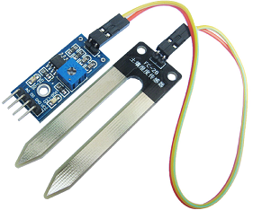

### 利用arduino nano开发板配合oled、温度传感器、光照传感器、湿度传感器设计一个花盘

> #### 前言：
>
> 本示例采用的开发板：arduino nano；
>
> ​					oled：0.96英寸oled（iic接口）；
>
> ​					温度传感器：ds18b20；
>
> ​					湿度传感器：
>
> ​					光照传感器：
>
> **示例将不分析代码的如何编写，只分析编写思路，因为我也只是才学了一天arduino就写这个程序，很多代码都是沿用之前51单片机中的代码，只不过51单片机采用的是位带操作，换到arduino就要采用相关语句才能操作其中的io口。**
>
> >#### iic配置：
> >
> >由于oled是采用iic接口通信的，万年不变定律，iic相关操作函数贴上：
> >
> >起始信号：void I2cStart(void)；
> >
> >终止信号：void I2cStop(void)；
> >
> >发送字节数据函数：unsigned char I2cSendByte(unsigned char dat)；
> >
> >#### oled配置：
> >
> >有了iic操作函数，接着根据oled命令表封装相关操作函数,不知道oled操作命令的可以翻我之前的文章，在oled配置那里有详细介绍，搬过来用即可
> >
> >oled写命令函数：void oled_Write_cmd(unsigned char cmd)；
> >
> >oled写数据函数：void oled_Write_data(unsigned char dat)；
> >
> >oled清屏函数：void oled_clear(void)；
> >
> >oled初始化函数：void oled_initial(void)；
> >
> >oled显示函数，这个函数是确定将要显示的位置，以及数据采样的格式：void oled_put_char_16x16(unsigned char x,unsigned char y,unsigned char t)；
> >//设置显示坐标函数,t为0时，字符为8x16t为1时，字符为16x16
> >
> >然后通过oled_Write_data（），将采样到的字符数据写入即可显示。
> >
> >#### ds18b20配置（在之前文章也有讲过ds18b20如何驱动及运用）：
> >
> >根据ds18b20操作手册：
> >
> >检测是否有ds18b20：unsigned char DS18B20_Check(void)；
> >
> >ds18b20初始化：void DS18B20_Init(void)；
> >
> >复位信号：void Rest_sign(void)；
> >
> >读一位数据：unsigned char DS18B20_Read_Bit(void)；
> >
> >读一字节数据：unsigned char DS18B20_Read_Byte(void)；
> >
> >写一字节数据：void DS18B20_Write_Byte(unsigned char dat)；
> >
> >开始信号：void DS18B20_Start(void)；
> >
> >获取温度函数：void get_Temperature(void)；
> >
> >#### 光照、土壤湿度传感器配置：
> >
> >**光照和土壤湿度传感器类似，都有DO和AO；**
> >
> >**DO是当测量值高于设定的阈值时会输出高电平，可以通过nano的模拟输入引脚或者数字输入输出引脚捕获，设定的阈值是通过旋转传感器上的电位计设定的，顺时针旋转会变大，反之变小。**
> >
> >**AO是通过测量值的大小转而输出不同的电压，nano模拟输入（ADC）的采样精度是0~1024，所以当我们采样AO上的电压时将会显示0~1024之间某个值value，通过用value/1024\*100,即可得到光照和土壤湿润的程度，我只能说是程度，而不是真正的光照强度和土壤湿度，因为光照强度和土壤湿度的计算相对复杂，我并不知道只有一个电压值怎样才能换算出。**
> >
> >DO判断，看是否超过阈值：void scan_DO(void)；
> >
> >获取光照程度：void get_Light_level(void)；值存放在全局变量Light_level，调用即可。
> >
> >获取湿润程度：void get_Humidity_level(void)；值存放在全局Humidity_level，调用即可。
> >
> >#### setup（）和loop():
> >
> >
> >